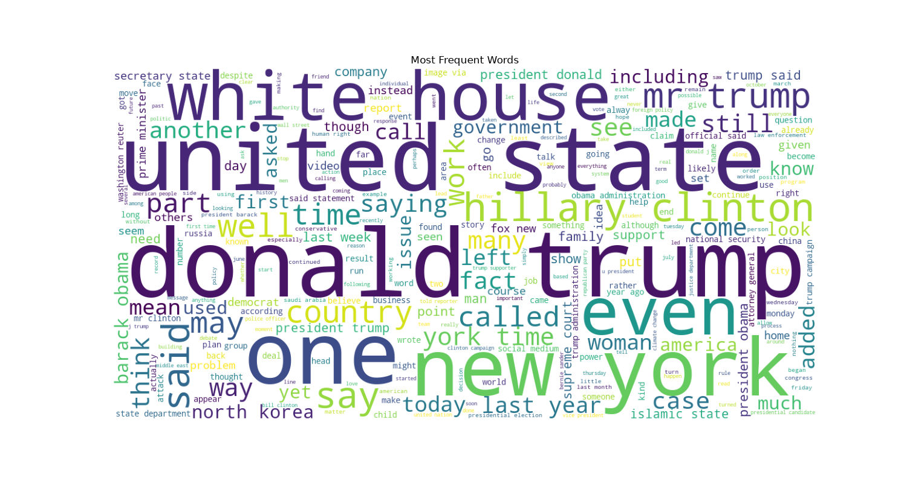
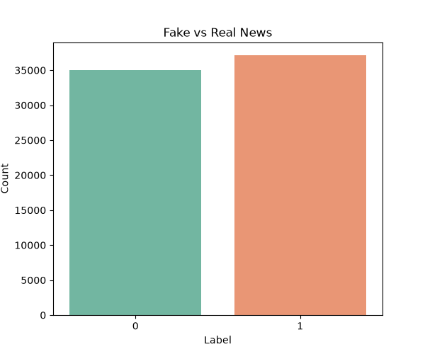
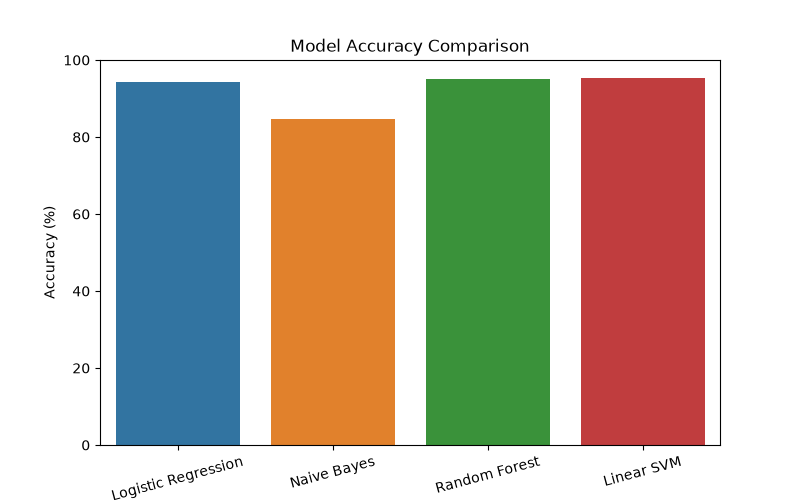

# 📰 TruthLens — Fake News Detection System

**BSc Data Science Final Year Project**

Classifies news articles as REAL or FAKE using Machine Learning and NLP.
Trained on 72,134 real-world news articles with **95.25% test accuracy**.

## 🔧 Tech Stack
- Python 3.10+
- scikit-learn (TF-IDF + Linear SVM / Passive Aggressive)
- NLTK (text preprocessing)
- Streamlit (web application)
- Pandas, NumPy, Matplotlib, Seaborn

## 📁 Project Structure
---

## 🚀 How to Run Locally

```bash
git clone https://github.com/arockiarishika4321-code/truthlens-app
cd truthlens-app
pip install -r requirements.txt
streamlit run app.py
```

---

## 📊 Model Performance

| Model | Accuracy |
|-------|----------|
| Passive Aggressive Classifier | 95.25% |
| Multinomial Naive Bayes | 91.30% |

---

## 🔍 How It Works

1. **Data Collection** — 72,134 news articles (Fake + Real) from Kaggle
2. **Text Cleaning** — Remove URLs, HTML, punctuation, stopwords, stemming
3. **TF-IDF Vectorization** — Convert words to numeric features
4. **Model Training** — Passive Aggressive Classifier trained and saved
5. **Web App** — Streamlit UI for real-time prediction

---

## 📂 Dataset

Kaggle — Fake and Real News Dataset by Clément Bisaillon
- Fake.csv — 23,481 fake news articles
- True.csv — 21,417 real news articles
- Total — 44,898 articles used for training

---

## 📸 Screenshots





---

## 🎓 Project Details

- **Student:** Arockia Rishika
- **Degree:** BSc Data Science
- **Project:** Final Year Project
- **App Name:** TruthLens
- **Accuracy:** 95.25%

---

## 📜 License

This project is open source and available for educational purposes.
